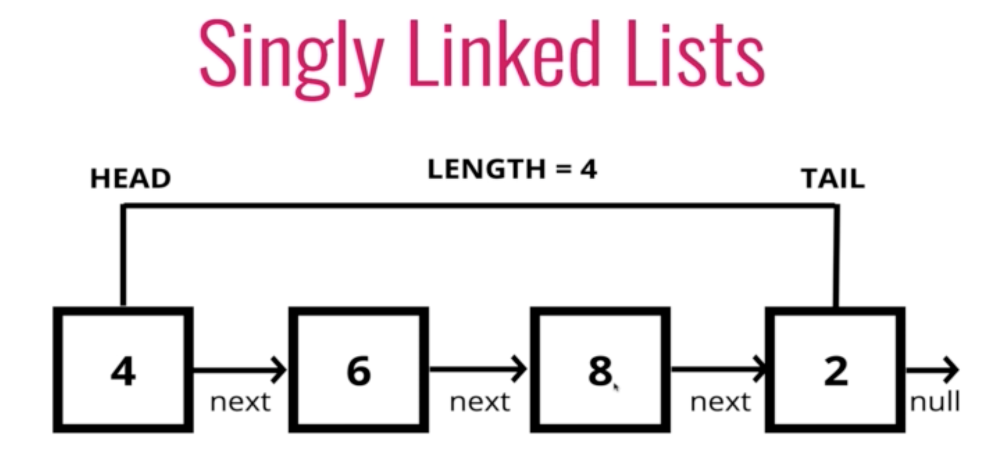

## Linked list란?

- head, tail 그리고 length를 가지고 있는 데이터 자료구조
- Linked list는 node로 이루어져 있고 각 node는 값과 다른 값을 알려주는 포인터를 가지고 있다.



## Comparisons with Arrays

### Lists

- Do not have indexs!
- Connected via nodes with a next pointer
- Random access is not allowed

### Arrays

- Indexed in order!
- Insertion and deletion can be expensive
- Can quickly be accessed at a specific index

```
// piece of data
// reference to next node

class Node {
    constructor(val) {
        this.val = val;
        this.next = null;
    }
}

var first = new Node("Hi")
first.next = new Node("there")
first.next.next = new Node("how")
first.next.next.next = new Node("are")
first.next.next.next.next = new Node("you")

```
