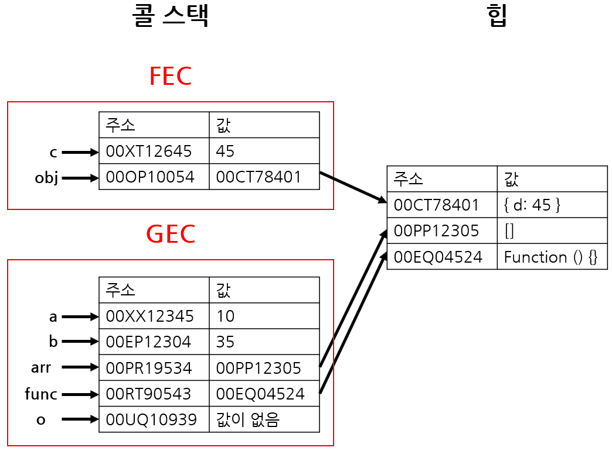
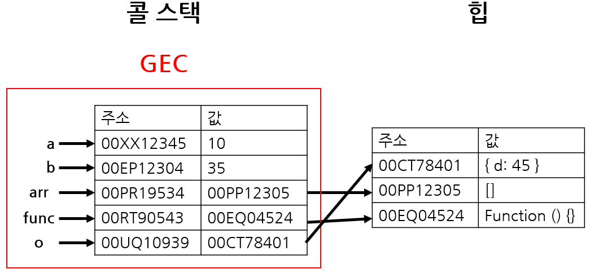

# 콜 스택(Call stack)과 힙(Heap)

---

자바스크립트 엔진이 자바스크립트를 실행할 때 원시 타입 및 참조 타입을 저장하는 메모리 구조로 콜 스택과 힙을 가진다.

- 콜 스택: 원시타입 값과 함수 호출의 실행 컨텍스트(Execution Context)를 저장하는 곳이다.
- 힙: 객체, 배열, 함수와 같이 크기가 동적으로 변할 수 있는 참조타입 값을 저장하는 곳이다.

### 예시를 통한 동작 원리 보기

```javascript
let a = 10;
let b = 35;
let arr = [];
function func() {
	const c = a + b;
	const obj = { d: c };
	return obj;
}
let o = func();
```

위 코드로 콜 스택과 힙의 동작을 살펴보면 다음과 같다
제일 처음, GEC(Global Execution Context)기 생성되고 원시 값은 콜 스택에, 참조 값은 힙에 저장된다.




